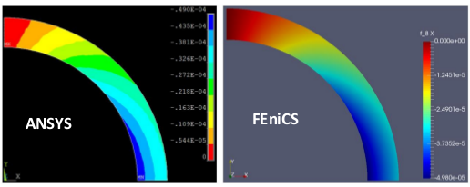

5. Axisymmetric Model
===========================================

We consider a sphere which is under an external pressure that could be taken as an axisymmetric problem.This geometry could be seen as revolution of a cross section with respect to the axis of symmetry as shown in the next figure:

5.1. Constitutive Equation
^^^^^^^^^^^^^^^^^^^^^^^^^^^^^
For an axisymmetric problem, the displacement field is defined as follows:

.. math:: 
  :name: eq.47

   u = u_r e_r + u_z e_z    

Another informative implementation of the axisymmetric model for linear elasticity could be found `here <https://comet-fenics.readthedocs.io/en/latest/demo/elasticity/axisymmetric_elasticity.html>`_.  The strain energy function is defined as presented in :ref:`equation.40 <eq.40>`.
In case of axisymmetric the gradient of displacement field is defined as: 

.. math:: 
  :name: eq.48 

   \nabla u = \begin{bmatrix} \frac {\partial u_r}{\partial r} & 0 & \frac {\partial u_r}{\partial z}\\0 & \frac {u_r}{r} & 0\\ \frac {\partial u_z}{\partial r} & 0 & \frac {\partial u_z}{\partial z}\end{bmatrix}

In general, In case of nonlinear problems, the abstract formulation for nonlinear form is defined as:

.. math:: 
  :name: eq.49

   F(u,v)=0 \ \forall v \in V

In order to find the F in the above equation, first we need to define total potential energy with regard to axisymmetric formulation:

.. math:: 
  :name: eq.50

   \phi= \int_{V} W(u) \,dV - \int_{\partial V} P \,dA 

Where :math:`W` is the strain energy function and :math:`P` corresponds to the loads applied on the boundaries. 
In the above equation :math:`dV` and :math:`dA` are the integration symbols over the domains :math:`V` and boundaries :math:`\partial V`. In axisymmetric formulation, we should replace the integration measure :math:`dV` and :math:`dA` by :math:`rd \theta dA` and :math:`rd \theta ds` respectively. After substitution in the above equation, the term :math:`d\theta` is cancelled out from both sides and the above equation yields to:

.. math:: 
  :name: eq.51

   \phi= \int_{A} W(u) \,rdA - \int_{\partial A} P \,rds 

In the next step by taking directional derivative from the :math:`\phi` with respect to the test function :math:`v` , we can find the :math:`F(u,v)` as following:

.. math:: 
  :name: eq.52

   F(u,v)= \lim_{\epsilon\to\infty} \frac {d}{d \epsilon} \phi(u+ \epsilon v)

5.2. Finite Element Implementation
^^^^^^^^^^^^^^^^^^^^^^^^^^^^^^^^^^
In order to generate the mesh, we considered the cross section of the sphere as a 2D axisymmetric problem. GMSH was used for mesh generation and structured mesh was created with triangular elements.The red arrows correspond to the external pressure on the sphere. The left edge (e.g. axis of symmetry) is constrained to move in the x direction while the bottom edge is constrained to move in the y direction.The parameters used for this simulation are: :math:`\mu = 1 MPa` , :math:`K = 1 GPa` and :math:`P = 10 Pa` .The dimensions of the geometry, mesh, pressure load and boundary conditions are shown in next figure:

.. figure:: PNG/7.png
   :align: center

   Geometry of the cross section making the hemisphere (Left), the mesh generated in GMSH (Middle), load and boundary conditions (Right)

The above equations were implemented in FEniCS. The FEniCS code is presented as here: 

.. code-block:: python

	from dolfin import *

	parameters["form_compiler"]["representation"] = "tsfc"

	mesh = Mesh("MESH.xml")

	facets = MeshFunction("size_t", mesh, "MESH_facet_region.xml")
	domains = MeshFunction("size_t", mesh, "MESH_physical_region.xml")

	ds = Measure("ds", subdomain_data=facets)
	dx = Measure('dx',subdomain_data=domains)

	#File("bound.pvd") << facets

	x = SpatialCoordinate(mesh)

	def GRAD(v):

		 return as_tensor([[v[0].dx(0), 0, v[0].dx(1)],
		                     [0, v[0]/x[0], 0],
		                     [v[1].dx(0), 0, v[1].dx(1)]])

	n = FacetNormal(mesh)
	p = Constant(100.)

	V = VectorFunctionSpace(mesh, 'CG', degree=2)
	# Define functions
	du  = TrialFunction(V)           # Trial function
	v = TestFunction(V)             # Test function
	u  = Function(V)                 # Displacement field

	d = u.geometric_dimension()
	I = Identity(3)
	F = I + GRAD(u)             # Deformation gradient

	#F = FF(u)

	C = F.T*F
	b = F*F.T
	Ic = tr(C)
	J  = det(F)
	Ib = tr(b)

	Ic_bar = pow(J,-2./3.)*Ic
	C_bar = pow(J,-2./3.)*C
	B_bar = pow(J,-2./3.)*b

	mu = 1E6
	K = 1E9

	psi = (mu/2. * (Ic_bar - 3.) + 0.5 * K * pow(ln(J),2)) * x[0]*dx - inner(-p*n, u)*x[0]*ds(4)

	bcs = [DirichletBC(V.sub(1), Constant(0), facets, 2),
		    DirichletBC(V.sub(0), Constant(0), facets, 1)]

	F1 = derivative(psi, u, v)

	# Compute Jacobian of F
	Jac = derivative(F1, u, du)

	problem = NonlinearVariationalProblem(F1, u, bcs, Jac)

	solver = NonlinearVariationalSolver(problem)

	solver.parameters["newton_solver"]["relative_tolerance"]=5e-9

	solver.solve()
	File("Displacement.pvd") << u

	SIGMA_XX = (K * ln(J) / J) * I[0, 0] + (2. / J) * (mu/2. * (B_bar[0, 0] - (1. / 3.) * Ic_bar * I[0, 0]))

	SIGMA_YY = (K * ln(J) / J) * I[1, 1] + (2. / J) * (mu/2. * (B_bar[2, 2] - (1. / 3.) * Ic_bar * I[1, 1]))

	W = FunctionSpace(mesh, 'P', 1)

	STRESS_XX = project(SIGMA_XX, W)
	STRESS_YY = project(SIGMA_YY, W)

	File("SIG_X.pvd") << STRESS_XX
	File("SIG_Y.pvd") << STRESS_YY

The same model with the same geometry, loading, boundary conditions and mesh was generated in ANSYS APDL. 

The PLANE 182 element was used for the simulation in ANSYS with axisymmetric element behavior. The displacement results in the x and y directions obtained from ANSYS and FEniCS implementation are shown in the next figures:

   The displacement results in X direction (FEniCS) vs ANSYS

.. figure:: PNG/9.png
   :align: center

   The displacement results in Y direction (FEniCS) vs ANSYS

