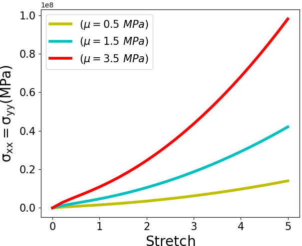

4. Compressible Model
===========================================

The strain energy function for a compressible neo-Hookean material is defined as: 

.. math:: 
  :name: eq.43

	W=\frac{\lambda}{2}{(lnJ)}^2 + \mu(lnJ) + \frac{1}{2} \mu (I_b-3)

In the above equation, the :math:`\lambda` is the Lame constant which is equal to :math:`\frac{E \nu}{(1+\nu)(1-2 \nu)}` where :math:`E` is Young modulud and :math:`\nu` is the poisson ratio. In addition, the stress terms is represented as:

.. math:: 
  :name: eq.44

	\sigma=J^{-1}[\lambda(lnJ) \textbf{I}+ \mu(\textbf{b}-I)]

A finite element implementation in FEniCS for a biaxial tension test on a hexahedron element is presented as follows: 

.. code-block:: python

	from dolfin import *

	stretch = [1,1.2,1.4,1.6,1.8,2,2.2,2.4,2.6,2.8,3,3.2,3.4,3.6,3.8,4,4.2,4.4,4.6,4.8,5,5.2,5.4,5.6,5.8,6]

	BC = []
	for x in range(len(stretch)):
		      M = stretch[x] - 1.0
		      BC.append(M)

	strain = []
	print (BC)
	for z in range(len(stretch)):
		      N = (BC[z])*100
		      strain.append(N)

	n = 1  # divisions in r direction
	mesh = BoxMesh(Point(0, 0, 0), Point(1, 1, 1), n, n, n)

	tol = 1E-14
	# Define boundaries
	def LEFT(x, on_boundary):
		      return on_boundary and x[0] < tol

	def RIGHT(x, on_boundary):
		      return on_boundary and abs(x[0] - 1.0) < tol

	def BOTTOM(x, on_boundary):
		      return on_boundary and x[1] < tol

	def TOP(x, on_boundary):
		      return on_boundary and abs(x[1] - 1.0) < tol

	def FRONT(x, on_boundary):
		      return on_boundary and abs(x[2] - 1.0) < tol

	def BACK(x, on_boundary):
		      return on_boundary and (x[2]) < tol

	boundaries = MeshFunction('size_t', mesh, mesh.topology().dim()-1)
	domains = MeshFunction('size_t', mesh, mesh.topology().dim())

	ds = Measure("ds", subdomain_data=boundaries)
	dx = Measure('dx',subdomain_data=domains)

	n = FacetNormal(mesh)

	V = VectorFunctionSpace(mesh, 'CG', degree=2)

	# Define functions
	du  = TrialFunction(V)           # Trial function
	v  = TestFunction(V)             # Test function
	u  = Function(V)                 # Displacement field

	# Kinematics
	d = u.geometric_dimension()
	I = Identity(d)             # Identity tensor
	F = I + grad(u)             # Deformation gradient
	C = F.T*F                   # Right Cauchy-Green tensor
	b = F * F.T                 # Left Cauchy-Green tensor
	Ic = tr(C)
	J  = det(F)

	nu =0.4
	G = 3.5e6
	E = 2.*G*(1.+ nu)
	mu  = Constant(E/(2*(1 + nu)))
	lmbda= Constant(E*nu/((1 + nu)*(1 - 2*nu)))

	# Total potential energy
	psi = ((lmbda / 2.)*pow(ln(J),2)-mu*ln(J)+0.5*mu*(Ic-3))*dx
	F1 = derivative(psi, u, v)

	# Compute Jacobian of F
	Jac = derivative(F1, u, du)

	sigma_11 = []
	sigma_22 = []
	JJJ = []

	def border(x, on_boundary):
		      return on_boundary

	bound_x =  Expression(("t*x[0]"), degree=1, t=0)
	bound_y =  Expression(("t*x[1]"), degree=1, t=0)

	SIG = []

	for t in range(len(stretch)):

		      bound_x.t = BC[t]
		      bound_y.t = BC[t]

		      bc_x = DirichletBC(V.sub(0), bound_x, border)
		      bc_y = DirichletBC(V.sub(1), bound_y, border)
		      bc_front = DirichletBC(V.sub(2), Constant((0)), FRONT)
		      bc_back = DirichletBC(V.sub(2), Constant((0)), BACK)

		      bc_all = [bc_x,bc_y,bc_front]

		      problem = NonlinearVariationalProblem(F1, u, bc_all, Jac)

		      solver = NonlinearVariationalSolver(problem)
		      solver.solve()

		      sigma = inv(J) * (lmbda * ln(J) * I + mu * (b - I))
		      cauchy = project(sigma, TensorFunctionSpace(mesh, 'DG', 0))

		      SIG.append(cauchy(1, 1, 0)[0])

	print (SIG)

The obtained result for three different shear modulus (i.e. :math:`\mu`) are compared in figure 10:

   Stress results of neo-Hokean compressible model for a single element under biaxial stretch

.. note:: 

   There is another form of strain energy function for a compressible neo-Hookean material: 

   .. math:: 
     :name: eq.45 

		W=\frac{1}{2}K(lnJ)^2 + \frac{1}{2} \mu (J^{\frac{-2}{3}} I_b-3)

   The stress tensor is defined as following: 

   .. math:: 
     :name: eq.46

		\sigma=J^{-1}[K \ ln(J)+ \mu J^{\frac{-2}{3}}(\textbf{b}-\frac{1}{3}tr(b) \textbf{I})]

   In the above equation, :math:`K` is the bulk modulus. As a practice you can implement th above equations in the code and compare your results with the previous forms of strain energy function and stress! 

