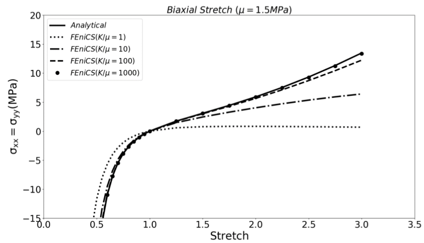
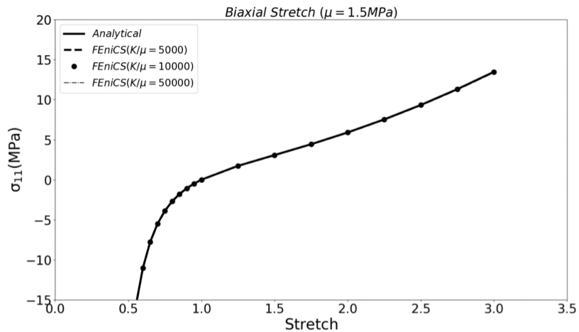
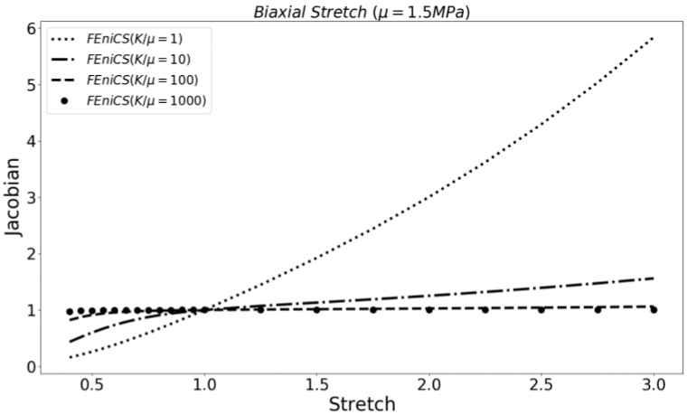

3. Nearly Incompressible Model
===========================================

3.1 Constitutive Equations
^^^^^^^^^^^^^^^^^^^^^^^^^^^^^^^^^^^^^^^^^^^^^^

For the nearly incompressible Neo-Hookean material, the bulk modulus appears in the strain energy function. It should be noted that as the ratio :math:`\frac{K}{\mu}`increases, the behavior of the material becomes closer to a fully incompressible material model (e.g. :math:`J` converges to unity).

The strain energy function is defined as:

.. math:: 
  :name: eq.40 

   W=c_1(I_1-3)+ \frac{1}{2}K(Ln(J))^2

Where :math:`I_1` corresponds to the first invariant of the :math:`C` where :math:`C=J^{\frac{-2}{3}}C`.The stress is defined as:

.. math:: 
  :name: eq.41

   \sigma=pI+ \frac{2}{J}[c_1 b - \frac{1}{3} (c_1 I_1)I]

In the above equation:

.. math:: 
  :name: eq.42
 
   p = K \frac{Ln(J)}{J}

3.2 Finite Element Implementation
^^^^^^^^^^^^^^^^^^^^^^^^^^^^^^^^^^^^^^^^^^^^^^

The FEniCS implementation of the neo-Hookean neraly incompressible material on a single hexahedron element under biaxial stretch is hsown as below: 

.. code-block:: python

	from dolfin import *

	parameters["form_compiler"]["representation"] = "tsfc"

	stretch = [0.95,1.,1.25,1.5,1.75,2,2.25,2.5,2.75,3]

	BC = []

	for x in range(len(stretch)):
		 N = stretch[x] - 1.0
		 BC.append(N)

	tol = 1E-14

	# Define boundary

	def FRONT(x, on_boundary):
		 return on_boundary and abs(x[2] - 1.0) < tol

	mesh = UnitCubeMesh.create(1,1,1,CellType.Type.hexahedron)

	############################################
	V = VectorFunctionSpace(mesh, 'CG', degree=1)

	du  = TrialFunction(V)           # Trial function
	v  = TestFunction(V)             # Test function
	u  = Function(V)
	#############################################

	boundaries = MeshFunction('size_t', mesh, mesh.topology().dim()-1)
	subdomains = MeshFunction('size_t', mesh, mesh.topology().dim())

	dx = Measure('dx', domain=mesh, subdomain_data=subdomains, metadata={'quadrature_degree': 2})
	ds = Measure('ds', domain=mesh, subdomain_data=boundaries, metadata={'quadrature_degree': 2})

	#################
	d = u.geometric_dimension()
	I = Identity(d)             # Identity tensor
	F = I + grad(u)             # Deformation gradient
	C = F.T*F                   # Right cauchy stress tensor
	b = F*F.T                   # Left cauchy stress tensor
	Ic = tr(C)
	J  = det(F)                 # Jacobian of deformation gradient tensor
	Ib = tr(b)                  # First invariant of b tensor

	Ic_bar = pow(J,-2./3.)*Ic
	C_bar = pow(J,-2./3.)*C
	B_bar = pow(J,-2./3.)*b

	# The bulk modulus (K) and shear modulus (mu) are defined here. Feel free to change them to see the effect of K/mu in the results
	mu = 1.5E6
	K = 7.5E10

	psi = (mu/2. * (Ic_bar - 3.) + 0.5 * K * pow(ln(J),2)) * dx

	F1 = derivative(psi, u, v)

	# Compute Jacobian of F
	Jac = derivative(F1, u, du)

	sigma_11 = [] # Array for storing the stress in x direction
	sigma_22 = [] # Array for storing the stress in y direction
	JJJ = [] # Array for storing the Jacobian

	def border(x, on_boundary):
		 return on_boundary

	bound_x =  Expression(("t*x[0]"), degree=1, t=0)
	bound_y =  Expression(("t*x[1]"), degree=1, t=0)

	for i in range(len(BC)):

		 bound_x.t = BC[i]
		 bound_y.t = BC[i]

		 bc_x = DirichletBC(V.sub(0), bound_x, border)
		 bc_y = DirichletBC(V.sub(1), bound_y, border)
		 bc_front = DirichletBC(V.sub(2), Constant((0)), FRONT)

		 bc_all = [bc_x,bc_y,bc_front]

		 problem = NonlinearVariationalProblem(F1, u, bc_all, Jac)

		 solver = NonlinearVariationalSolver(problem)

		 solver.solve()

		 #sig = inv(J)*(lmbda*ln(J)*I + mu * (b - I))

		 sig = (K * ln(J) / J) * I + 2./J * (mu/2. * B_bar - 1./3. * (mu / 2.) * Ic_bar * I)

		 S = TensorFunctionSpace(mesh, 'P', 1)

		 W = FunctionSpace(mesh, 'P', 1)

		 sig1 = project(sig, S)

		 JJ = project(J, W)

		 JJJ.append((JJ.vector().get_local()[0]))

		 sigma_11.append((sig1.vector().get_local()[0])*0.000001)
		 sigma_22.append((sig1.vector().get_local()[4])*0.000001)

		 File("displacement.pvd") << u

	print (sigma_11)
	print (sigma_22)
	print (JJJ)

  
Next figure shows how stress – stretch behavior of the model alters as the ratio :math:`\frac{K}{\mu}` increases.

   Effect of compressibility in biaxial tension test– FEM (FEniCS) vs Analytical Solution

The above figure illustrates that when :math:`\frac{K}{\mu}>100` the behavior of the model starts converging to the fully incompressible Neo-Hookean model. When :math:`\frac{K}{\mu}>1000` the solution is matched with the fully incompressible material model as shown in next figure: 

   Nearly incompressible material in biaxial tension test– FEM (FEniCS) vs Analytical
 
The other test that was implemented was tracking the Jacobian when the stretch increases which is shown in the next figure:

   Effect of compressibility in the Jacobian of deformation gradient tensor in biaxial tension test

It could be seen that by approaching the :math:`\frac{K}{\mu}` ratio to 1000, the Jacobian is set to unity regardless of the value of stretch showing the material is nearly incompressible.

